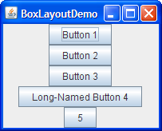

# Intrefaces

Beispiel aus der letzten Woche: `return "Weiß ich nicht :("` ist unschön 

```java
public class Uhr {
  public String tick() { return "Weiß ich nicht :("; }
}
public class Turmuhr extends Uhr {
  public String tick() { return "TICK! TOCK!"; }
}
public class Armbanduhr extends Uhr {
  public String tick() { return "Ticketacke."; }
}
Turmuhr bigBen = new Turmuhr();
boolean isTurmuhr = bigBen instanceof Turmuhr; // true
boolean isUhr = bigBen instanceof Uhr; // true
boolean isArmbanduhr = bigBen instanceof Armbanduhr; // false
```

---

# Interfaces (II)

Lösung: Allgemeiner "Vertrag", was die Klasse kann, ohne Implementation

```java
public interface Uhr {
  public String tick(); // Sagt nur: Jede Uhr muss tick() können
}
public class Turmuhr implements Uhr { // implements, nicht extends!
  public String tick() { return "TICK! TOCK!"; }
}
public class Armbanduhr implements Uhr {
  public String tick() { return "Ticketacke."; }
}
Uhr meineUhr = new Uhr(); // Geht nicht - was wäre meineUhr.tick()?
Turmuhr bigBen = new Turmuhr();
```
---

# Intrefaces (III)

Im Gegensatz zu Klassen: Interfaces können mehrfach "geerbt" werden (da keine Implementation: Keine Konflikte möglich)

```java
public interface Uhr {
  public String tick(); // Sagt nur: Jede Uhr muss tick() können
}
public interface LaermMacher {
  public double getDecibel();
}
public class Turmuhr implements Uhr, Laermmacher { // Mehrere Interfaces
  public String tick() { return "TICK! TOCK!"; }
  public double getDecibel() { return 75.3; }
}
// Ein Turmuhr-Objekt ist instanceof Uhr und instanceof LaermMacher!
```

---

# Casten von Objekten

Spezifisch -> allgemein geht, anders rum nicht

```java
public interface Uhr {
  public String tick(); // Sagt nur: Jede Uhr muss tick() können
}
public class Turmuhr implements Uhr {
  public String tick() { return "TICK! TOCK!"; }
}
public class BigBen extends TurmUhr {
  public String holidayBell() { return "Big ben's musical ringing!"};
}
BigBen bb = new BigBen();
bb.holidayBell(); // geht
Uhr grosseuhr = (Uhr) bb; // geht, denn BigBen erbt von Uhr
grosseuhr.holidayBell(); // geht nicht mehr - Uhr hat kein holidayBell()!
```

---

# Abstrakte Klassen

* Problem: Manchmal teilweise gemeinsame Logik, teilweise nur geforderte Funktionalität.
* Lösung: Abstrakte Klassen. Sie können:
  * Wie "normale" klassen Methoden implementieren
  * Wie interfaces nur Funktionalität von erbenden Klassen fordern (`abstract`-Methoden)
  * Wie intrefaces nicht direkt instanziiert werden (weil die abstrakten Methoden keinen Code enthalten und nicht aufgerufen werden könnten)  

---

# Abstrakte Klassen (II)

Einfaches Beispiel:
```java
public abstract class Kunstwerk {
  private String owner;
  public void setOwner(String newOwner) { owner = newOwner; } // wie class
  public abstract String[] getMaterials(); // wie interface
}
public class Bild extends Kunstwerk {
  public String[] getMaterials() { return new String[] {"Farbe", "Stoff"}; }
}
Kunstwerk meinBild = new Kunstwerk(); // Geht nicht, abstrakte Klasse!
Bild meinBild = new Bild(); 
boolean istKunstwerk = meinBild instanceof Kunstwerk; // true 
```

---

# Interfaces + (abstrakte) Klassen

Klassen können von maximal einer Klasse ableiten **und** gleichzeitig mehrere Interfaces implementieren:

```java
public abstract class Kunstwerk {
  private String owner;
  public void setOwner(String newOwner) { owner = newOwner; } // wie class
  public abstract String[] getMaterials(); // wie interface
}
public class UhrenKunstwerk extends Kunstwerk implements Uhr {
  public String[] getMaterials() { return new String[] {"Farbe", "Stoff"}; }
  public String tick() { return "Kunstvolles ticken"; }
}
UhrenKunstwerk dalliStatue = new UhrenKunstwerk();
Uhr tolleUhr = (Uhr) dalliStatue; // geht, denn UhrenKustwert ist auch Uhr
```

---


# GUI in Java: Swing

* Hierarchisch aufgebautes GUI
* Starke Nutzung von Vererbung
  * JComponent ist Container
  * JComponents können JComponents enthalten
  * Spezifische Logik (z.B. Klickverhalten) in tieferen Klassen
* Top-level-Container: JFrame

---

# GUI in Java: Layout

* Hierarchischer Aufbau z.B. "`JFrame` enthält 5 `JButton`"
* Wie genau darstellen? -> Wird von `LyoutManager` entschieden
* Drei Beispiele für gleiche Hierarchie, anderer `LayoutManager`:

  

---

# GUI in Java: Live-Demo

* Kurzes Beispiel:
  * JFrame aus `main()` heraus anzeigen
  * Einfacher GUI-Aufbau:
    * Menuleiste erstellen
    * 4 unterschiedliche `LayoutManager`
* Nachzuvollziehen im [git-Repo](https://github.com/dabrowskiw/Programmierung2-Materialien/tree/master/Examples/GUIBasics)